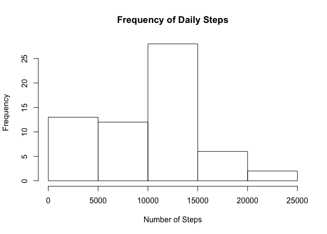
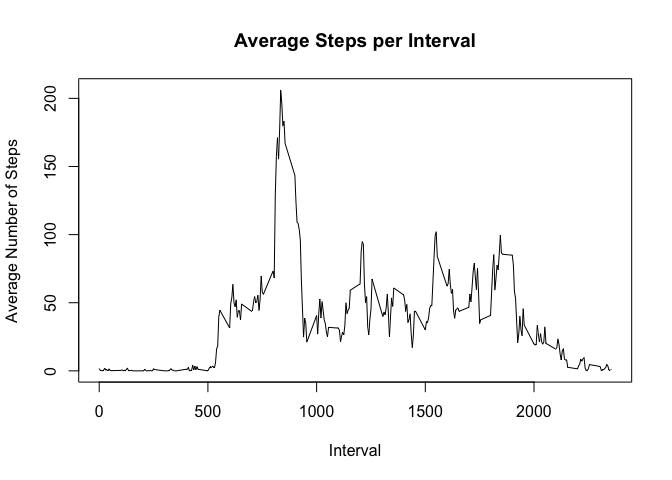
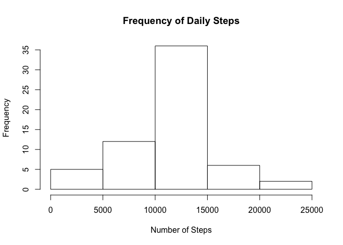
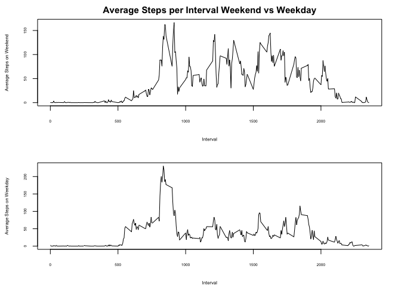

#### Load libraries to R

```r
library(dplyr)
library(chron)
```

#### Extract data and read data into R

```r
unzip("activity.zip")
activity_data <- read.csv("activity.csv", stringsAsFactors = TRUE)
```

The following code I used to review the data structure

```r
head(activity_data)
```

```
##   steps       date interval
## 1    NA 2012-10-01        0
## 2    NA 2012-10-01        5
## 3    NA 2012-10-01       10
## 4    NA 2012-10-01       15
## 5    NA 2012-10-01       20
## 6    NA 2012-10-01       25
```

```r
str(activity_data)
```

```
## 'data.frame':	17568 obs. of  3 variables:
##  $ steps   : int  NA NA NA NA NA NA NA NA NA NA ...
##  $ date    : Factor w/ 61 levels "2012-10-01","2012-10-02",..: 1 1 1 1 1 1 1 1 1 1 ...
##  $ interval: int  0 5 10 15 20 25 30 35 40 45 ...
```

```r
summary(activity_data)
```

```
##      steps                date          interval     
##  Min.   :  0.00   2012-10-01:  288   Min.   :   0.0  
##  1st Qu.:  0.00   2012-10-02:  288   1st Qu.: 588.8  
##  Median :  0.00   2012-10-03:  288   Median :1177.5  
##  Mean   : 37.38   2012-10-04:  288   Mean   :1177.5  
##  3rd Qu.: 12.00   2012-10-05:  288   3rd Qu.:1766.2  
##  Max.   :806.00   2012-10-06:  288   Max.   :2355.0  
##  NA's   :2304     (Other)   :15840
```
We can see that there are 17568 observations of 3 variables (number of steps, date & interval)

Beacuse the date column is stored as a factor, let's convert the date column to a date format

```r
activity_data$date <- as.Date(activity_data$date)
```

### What is mean total number of steps taken per day?
#### Calculate the total number of steps taken per day


```r
total_steps_per_day <- activity_data %>%
  group_by(date) %>%
  summarise(total_steps = sum(steps, na.rm=TRUE))
```

#### Make a histogram of the total number of steps taken each day

```r
hist(total_steps_per_day$total_steps,
     ylab = "Frequency",
     xlab = "Number of Steps",
     main = "Frequency of Daily Steps"
     )
```

<!-- -->

#### Calculate and report the mean and median of the total number of steps taken per day

```r
summary(total_steps_per_day$total_steps)
```

```
##    Min. 1st Qu.  Median    Mean 3rd Qu.    Max. 
##       0    6778   10395    9354   12811   21194
```

### What is the average daily activity pattern?
#### Make a time series plot of the 5-minute interval and the average number of steps taken, averaged across all days

```r
average_steps_per_interval <- activity_data %>%
  group_by(interval) %>%
  summarise(average_steps = mean(steps, na.rm=TRUE))

with(average_steps_per_interval,
     plot(interval, average_steps,
          type = "l",
          ylab = "Average Number of Steps",
          xlab = "Interval",
          main = "Average Steps per Interval"
          ))
```

<!-- -->

#### Which 5-minute interval, on average across all the days in the dataset, contains the maximum number of steps?

```r
average_steps_per_interval$interval[max(average_steps_per_interval$average_steps)]
```

```
## [1] 1705
```
As per above, the 1705 interval contains the most number of steps

### Imputing missing values
#### Calculate and report the total number of missing values in the dataset

```r
summary(is.na(activity_data))
```

```
##    steps            date          interval      
##  Mode :logical   Mode :logical   Mode :logical  
##  FALSE:15264     FALSE:17568     FALSE:17568    
##  TRUE :2304
```
We can see that there are 2304 missing values in the steps column

#### Devise a strategy for filling in all of the missing values in the dataset. The strategy does not need to be sophisticated. For example, you could use the mean/median for that day, or the mean for that 5-minute interval, etc.


I checked the number of NAs per day to determine if I can use the average per day, or the average per interval

```r
percentofNAs_data <- activity_data %>%
  group_by(date) %>%
  summarise(percentofNAs = mean(is.na(steps))) %>%
  filter(percentofNAs>0)
print(percentofNAs_data)
```

```
## # A tibble: 8 x 2
##   date       percentofNAs
##   <date>            <dbl>
## 1 2012-10-01            1
## 2 2012-10-08            1
## 3 2012-11-01            1
## 4 2012-11-04            1
## 5 2012-11-09            1
## 6 2012-11-10            1
## 7 2012-11-14            1
## 8 2012-11-30            1
```
Because we can see that only entire days are missing values, I will impute by filling in the missing data with the average for that 5 minute interval

#### Create a new dataset that is equal to the original dataset but with the missing data filled in.


```r
imputed_activity_data <- activity_data %>%
  group_by(interval) %>%
  mutate(steps=ifelse(is.na(steps),mean(steps,na.rm=TRUE),steps))
```

#### Make a histogram of the total number of steps taken each day and Calculate and report the mean and median total number of steps taken per day.


```r
total_steps_per_day_imputed <- imputed_activity_data %>%
  group_by(date) %>%
  summarise(total_steps = sum(steps, na.rm=TRUE))

hist(total_steps_per_day_imputed$total_steps,
     ylab = "Frequency",
     xlab = "Number of Steps",
     main = "Frequency of Daily Steps"
     )
```

<!-- -->

```r
summary(total_steps_per_day_imputed$total_steps)
```

```
##    Min. 1st Qu.  Median    Mean 3rd Qu.    Max. 
##      41    9819   10766   10766   12811   21194
```

#### Do these values differ from the estimates from the first part of the assignment?
Yes, we can see that the frequency of the number of steps below 5000 has significantly reduced with the remaining frequencies increased.

#### What is the impact of imputing missing data on the estimates of the total daily number of steps?
We can't use the total daily number of steps because there are entire days which do not have values.

### Are there differences in activity patterns between weekdays and weekends?
#### Create a new factor variable in the dataset with two levels – “weekday” and “weekend” indicating whether a given date is a weekday or weekend day.


```r
imputed_activity_data_wd <- imputed_activity_data %>%
  mutate(weekday = ifelse(is.weekend(date),"weekend", "weekday"))
```

#### Make a panel plot containing a time series plot


```r
average_steps_per_interval_wd <- imputed_activity_data_wd %>%
  group_by(interval, weekday) %>%
  summarise(average_steps = mean(steps, na.rm=TRUE))

weekend_steps_data <- average_steps_per_interval_wd %>%
  filter(weekday == "weekend")

weekday_steps_data <- average_steps_per_interval_wd %>%
  filter(weekday == "weekday")

par(mfrow = c(2,1), cex = 0.8, cex.lab = 0.6, cex.axis = 0.5, mar = c(4.1, 4.1, 2.1, 2.1))
with(weekend_steps_data,
     plot(interval, average_steps, type = "l",
          ylab = "Average Steps on Weekend",
          xlab = "Interval",
          main = "Average Steps per Interval Weekend vs Weekday"
          ))
with(weekday_steps_data,
     plot(interval, average_steps, type = "l",
          ylab = "Average Steps on Weekday",
          xlab = "Interval",
          ))
```

<!-- -->
